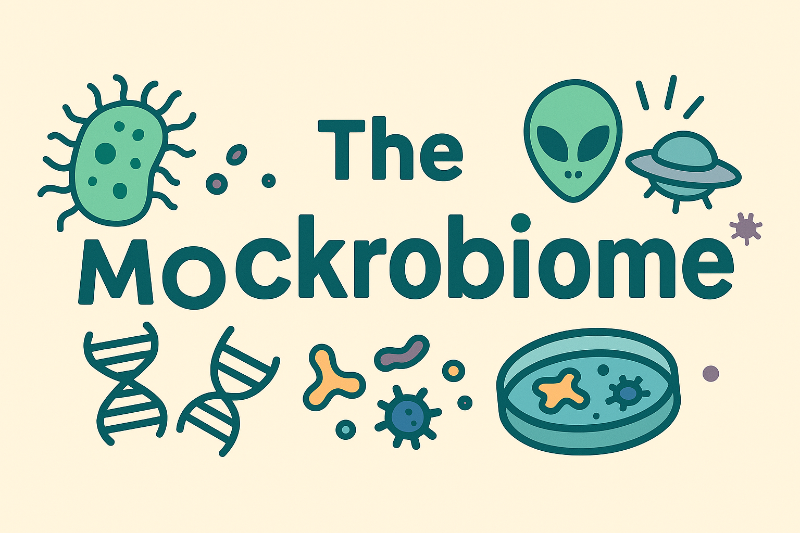

  

# 🦠 Mock-robiome

Welkom in **Mock-robiome**, waar de data nep is, maar de structuur *verrassend oké* is. Deze repo is gemaakt om te laten zie hoe je een bio-informatica project structureert in GitHub met behulp van een compleet onzinnige microbiële data.

Perfect voor:
- Wegwijs worden in GitHub
- Het leren structureren van data

## 🧬 Inhoud

- `data/` – fictionele datasets van aliensoorten, niet bestaande genen, en pseudo-microbiomen
- `scripts/` – scripts om prachtige onzin te genereren

> “We sequence, therefore we pretend.”

---

## 📊 Resultaten

Zie de [resultatenbespreking](resultaten/bespreking_resultaten.md) voor meer info.

