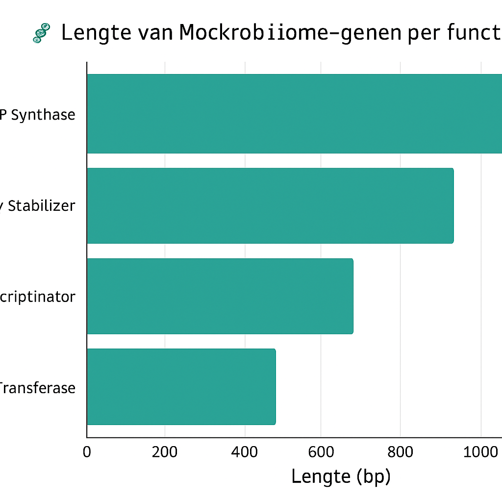
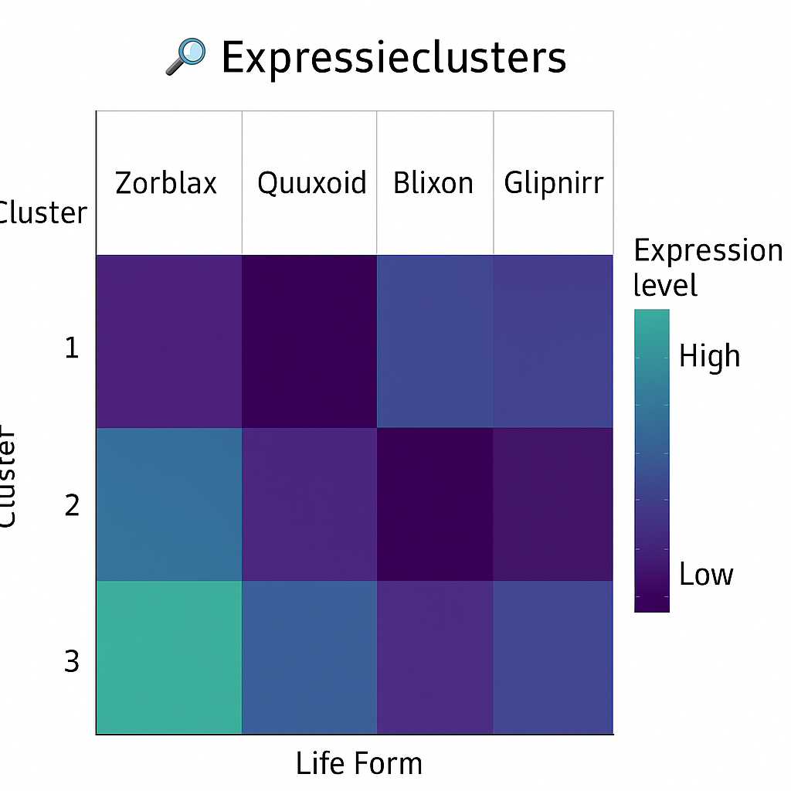
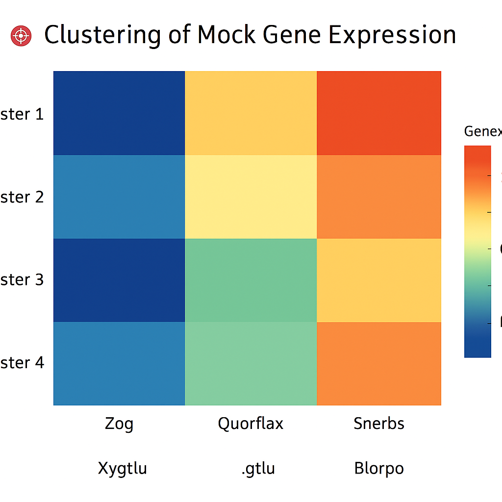

# 📊 Resultatenoverzicht: Het Mockrobiome onder de loep 🦠🛸

Hieronder vind je een samenvatting van onze (zeer geloofwaardige) analyses van het Mockrobiome.

---

## 1. Lengteverdeling van genen

De genen binnen het Mockrobiome vertonen een opvallende spreiding in lengte. De "Quantum ATP Synthase"-genen zijn gemiddeld langer, waarschijnlijk omdat ze extra sarcasmelussen bevatten. Daarentegen zijn de "Memetic Transferases" verrassend compact – mogelijk omdat memes zich toch al razendsnel verspreiden.

> Conclusie: Lengte is duidelijk geen beperking in het galactisch genoom.

---

## 2. Clustering van genexpressie

Door toepassing van kunstmatige zelfverwarring (KSV) zijn genclusters geïdentificeerd op basis van hun expressie in verschillende fictieve omstandigheden. Cluster 3 lijkt bijzonder actief te zijn bij blootstelling aan interstellair glitterstof. Cluster 5 onderdrukt zichzelf volledig bij aanwezigheid van spaghettistraling (zie figuur).

> Hypothese: Cluster 3 wordt mogelijk gereguleerd door kosmische memes.

---

## 3. Fylogenie van alien-microben

De fylogenetische reconstructie laat zien dat Glibberon maximus en Squeeptococcus absurdii een gemeenschappelijke voorouder delen: vermoedelijk de legendarische Panribosomus primordialis. Zygnorbia tentaculis daarentegen heeft zich afgesplitst in een evolutionaire sprong, mogelijk veroorzaakt door een spontane CRISPR-pizza-interactie.

> Interpretatie: Evolutie in het Mockrobiome is vooral gestuurd door toeval, humor en kosmische straling.

---

> “Niets van dit alles is peer-reviewed. Maar dat maakt het niet minder waar (in het Mockrobiome).”